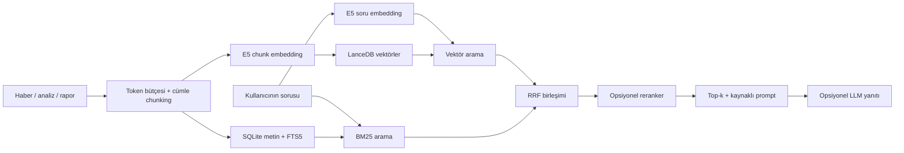

# Crypto Deep Research

Kripto varlıklar için araştırma, kaynak arama ve değerlendirme sistemi.
**10 analiz modülü ve 66 kriterden** kaynaklı Türkçe rapor ve hazır prompt üretir;
haber, analiz ve geçmiş raporlarda **yerel hybrid RAG** ile soru-cevap bağlamı bulur.
Web arayüzü, CLI, REST API ve 12 araçlı MCP sunucusu içerir.

Metin ve vektör depoları, embedding ve rapor oluşturma yerelde çalışır. Piyasa/haber
verileri dış sağlayıcılardan gelir; OpenRouter yanıtı ve çeviri isteğe bağlı harici
model çağrılarıdır. Temel araştırma ve kaynak arama için LLM anahtarı gerekmez.

> Araştırma amaçlıdır, yatırım tavsiyesi değildir. Heuristik yön yüzdesi ölçülmüş
> başarı oranı değildir. [Örnek BTC raporu](examples/ornek-rapor-BTC.md),
> 12 Eylül 2026 tarihli tarihsel çıktıdır; güncel piyasa tahmini değildir.

## Hızlı başlangıç

### Docker

```bash
git clone https://github.com/alikula37/crypto-deep-research.git
cd crypto-deep-research
docker compose up -d --build
```

### Yerel kurulum

Python **3.10+**, [uv](https://docs.astral.sh/uv/) ve web derlemesi için
Node.js **22.12+** gerekir. Komutları depo kökünde çalıştırın:

```bash
git clone https://github.com/alikula37/crypto-deep-research.git
cd crypto-deep-research
uv sync --frozen
cp .env.example .env
npm --prefix web ci
npm --prefix web run build
uv run cdr serve
```

Mevcut kurulumda `.env` dosyanızı koruyun. Kurulum güncel `main` kaynak kodundan yapılır;
eski/global `cdr` komutu yerine depo kökünde **`uv run cdr`** kullanın. `web/dist` üretilmeden
backend web arayüzünü sunamaz; yalnız `uv sync` yeterli değildir. Kod güncellemesinden
sonra web'i de yeniden derleyin. Sunucu terminal açıkken çalışır.

- [Uygulama](http://127.0.0.1:8000)
- [Nasıl Çalışır? · mülakat modu](http://127.0.0.1:8000/?tab=how&mode=interview)
- [REST API dokümanı](http://127.0.0.1:8000/docs)
- [Kurulum, güncelleme, veri dizinleri ve sorun giderme](docs/getting-started.md)

İlk embedding kullanımında model indirilir; süre ve disk ihtiyacı seçilen modele bağlıdır.
İlk açılışta varsayılan takip listesi oluşturulur ve otomatik araştırmalar çalışabilir.
Bu davranışlar `.env` üzerinden kapatılabilir.

## Üründe neler var?

| Menü | İçerik |
| --- | --- |
| Araştırma | Fiyat/mum grafiği, skor, 10 modül, 66 kriterin bulgu/güven/veri durumu |
| Analiz | Geçmiş sonuçların ileri getirileri, kalibrasyon görünümü, 2–4 varlık karşılaştırması |
| Takip | Takip listesi, alarmlar, manuel portföy, fonlama carry paper takibi |
| Üretim | Markdown rapor, kopyalama/indirme/yazdırma, prompt, opsiyonel LLM ve çeviri |
| Arşiv | Yerel kaynak arama ve geçmiş raporlar |
| Rehber | Tıklanabilir mimari, chunk/overlap laboratuvarı, embedding ve RRF örnekleri |

Araştırma işleri arka planda ilerleme bildirir ve SQLite'ta saklanır. Eksik veri
`veri yok` olarak gösterilir ve skor ortalamasına alınmaz; kısmi veri yarım ağırlıkla,
aynı sinyali paylaşan kriterler grup düzeltmesiyle hesaba katılır.
Dengeli, Muhafazakâr ve Agresif profilleri ağırlıkları değiştirir.

Klavye: `/` aramaya git · `⌘/Ctrl + K` komut paleti · `?` yardım ·
`⌘/Ctrl + Enter` derin araştırma · `Esc` kapat.
Telegram botu opsiyoneldir: `cdr telegram`; `/fiyat`, `/skor`, `/rapor`, `/arastir`, `/yardim`.
Fonlama carry bölümü simülasyon/paper takiptir; gerçek emir göndermez.

## Teknolojiler ve akış

| Katman | Teknoloji / görev |
| --- | --- |
| Backend | Python, FastAPI, Uvicorn, Pydantic, Typer |
| Veri toplama | HTTPX, piyasa/on-chain sağlayıcıları, RSS ve haber yedekleri |
| Metin ve durum | SQLite: tam kaynaklar, chunk metni/metadata, araştırma işleri ve öğrenme kayıtları |
| Sözcüksel arama | SQLite FTS5 + BM25 |
| Embedding | FastEmbed / ONNX; varsayılan `intfloat/multilingual-e5-large`, 1024 boyut |
| Vektör deposu | Yerel LanceDB |
| Fusion / reranking | RRF (`60` sıra sabiti); opsiyonel FastEmbed cross-encoder |
| Opsiyonel yanıt | Kaynak numaralı prompt → OpenRouter |
| Frontend | React 19, Vite 8; rehberde isteğe bağlı Three.js sahneleri |
| Finansal ML | Yerel lojistik regresyon / boosted trees, Platt veya izotonik kalibrasyon |



Varsayılan chunking **240 token bütçesi / en fazla 40 tokenlık overlap hedefi** kullanır.
Tam cümleler sığdırılır; bütçeyi aşan tek cümle token parçalarına bölünür. Gerçek overlap
cümle boylarına göre daha az veya sıfır olabilir. Ürünün soru-cevap bağlamı varsayılan
**8 chunk** içerir. [Ayrıntılı mimari ve uygulama sınırları](docs/architecture.md).

## Ölçülmüş sonuçlar ve sınırları

Kaynak bulma, yanıt desteği ve finansal tahmin **ayrı** değerlendirilir.
AUC/Brier/ECE, RAG başarı skoru değildir. Son kaydedilmiş deneyler:

| Deney | Sonuç | Kapsam / sınır |
| --- | --- | --- |
| [RAG pilotu · 2 Ekim 2026](docs/experiments/2026-10-rag-retrieval-pilot.md) | Hybrid HitRate@5 = 0,80 (4/5 test sorusu) | 107 kaynak; asistan taslağı etiketler; insan yanıt kalitesi ölçümü yok |
| [Chunk yöntemi · 2 Ekim 2026](docs/experiments/2026-10-sentence-chunking.md) | Sabit token ve cümle yönteminin ölçülen retrieval metrikleri eşit | 170 kaynak, 5 dev sorusu; kalite artışı gösterilmedi |
| [Chunk bütçesi · 3 Ekim 2026](docs/experiments/2026-10-chunk-tuning.md) | Geçici dev önerisi 240/80; kanıt kapsamı@5 24/24, 240/40'ta 23/24 | 252 kaynak, 24 dev sorusu, 7 ayar; taslak etiketler, final test açılmadı |
| [Finansal baseline · 2 Ekim 2026](docs/experiments/2026-10-backfill-baseline.md) | 1/7/30 gün modellerinin hiçbiri baseline Brier'ı geçemedi; üçü de reddedildi | 7.400 tarihsel satır; ayrı kalibrasyon ve final holdout; model aktifleştirilmedi |

Chunk bütçesi deneyinde 240/0 da 24/24 kanıt buldu; donmuş seçim kuralında 240/80,
nDCG aşamasında öne çıktı. Bootstrap fark aralığı sıfırı içerir. Etiketler insan
incelemesi beklediği ve ürünün `k=8` kesimi henüz ölçülmediği için **ürün varsayılanı
240/40 korunur**. Bu farklı korpus ve sorgu kümelerinin skorları doğrudan karşılaştırılmaz.
[Deney dizini](docs/experiments/README.md) protokollere ve ham sonuçlara yönlendirir.

Finansal eğitimde erken dönemde purged walk-forward model seçimi, sonraki ayrı dönemde
kalibratör fit'i ve son kronolojik holdout'ta değerlendirme vardır. Tarih grupları birlikte
kalır; ileri getiri ufku sınırlara değen/aşan örnekler çıkarılır. Aynı holdout üzerinde
yeniden ayar seçimi yapılırsa yeni bir final dönem gerekir.

## Mülakatta gösterim

**Rehber → Nasıl Çalışır? → Mülakat modu** üzerinden mimari kutularını veya ok etiketlerini
açın; seçilen adımı laboratuvarda inceleyin. Chunk sınırları ve overlap, embedding
koordinatları, dense/BM25 sıraları, RRF katkıları ve kaynaklı prompt gösterilir.
“Boyutu nasıl seçiyoruz?” paneli kaydedilmiş deneyi açar; bir ayarı seçip kurgu belgedeki
sınırlarını görebilirsiniz. Panel ürün ayarlarını değiştirmez.

910 tokenlık öğretim belgesinin tokenizer çıktıları, embedding'leri ve retrieval sıraları
gerçek hesaplamalardır; kayıtlı 240/40 indekslerini kullanırlar. Diğer bütçeler chunk
laboratuvarını değiştirir. Reranker sırası ve örnek yanıt öğretim için yazılmıştır;
tur canlı model/benchmark çağrısı yapmaz. Sunum düğmesi sabittir; hareket azaltma ve
WebGL olmadığında metin görünümü desteklenir.

## Sık kullanılan CLI komutları

```bash
uv run cdr snapshot bitcoin
uv run cdr deep-research bitcoin --platform claude --json
uv run cdr search "ETF akışları" --coin bitcoin --json
uv run cdr ask "BTC likidasyon riski nedir?" --coin bitcoin --json
uv run cdr rag-reindex --strategy sentence --chunk-tokens 240 --overlap-tokens 40
uv run cdr rag-eval data/rag-evaluation.jsonl --split dev --retrieval hybrid --json
uv run cdr rag-chunk-tune data/rag-chunk-dev.jsonl --output data/chunk-selection.json
uv run cdr rag-answer-eval data/rag-answers.jsonl --split test --json
uv run cdr learning-fill
uv run cdr ml-train --source backfill --features base --json
uv run cdr ml-eval --horizon 7
uv run cdr mcp
```

`data/rag-*.jsonl` dosyaları kendi arşiviniz için hazırlayacağınız etiketli veri setleridir;
klonla birlikte gelmez. Şema, dev/test ayrımı, `rag-chunk-rescore` ve diğer örnekler:
[RAG benchmark rehberi](docs/rag-benchmark.md). Bütün komutlar için `uv run cdr --help`.
Docker içinde örnek: `docker compose run --rm app cdr snapshot bitcoin`.

### MCP bağlantısı

MCP istemcinizin stdio sunucu yapılandırmasına ekleyin:

```json
{
  "mcpServers": {
    "crypto-deep-research": {
      "command": "uv",
      "args": ["--directory", "/TAM/YOL/crypto-deep-research", "run", "cdr", "mcp"]
    }
  }
}
```

12 araç: `list_analyses`, `list_research_items`, `resolve_coin`, `get_market_snapshot`,
`run_analysis`, `get_price_chart`, `deep_research`, `search_context`, `list_reports`,
`get_report`, `get_run`, `get_prompt`. İstemcinin MCP ayar ekranı/yolu istemciye göre değişir.

## Yapılandırma

Başlangıç şablonu [.env.example](.env.example); anahtarlar opsiyoneldir.

| Değişken | Varsayılan / görev |
| --- | --- |
| `CDR_DATA_DIR` / `CDR_STATE_DIR` | `data` / belirtilmezse veri dizini; raporlar / SQLite ve vektörler |
| `CDR_EMBEDDING_MODEL` / `CDR_EMBEDDINGS_ENABLED` | `intfloat/multilingual-e5-large` / `true` |
| `CDR_RAG_CHUNK_STRATEGY` | `sentence`; `token` sabit pencere baseline |
| `CDR_RAG_CHUNK_TOKENS` / `CDR_RAG_CHUNK_OVERLAP_TOKENS` | `240` / `40`; overlap bütçeden küçük olmalı |
| `CDR_RAG_RERANKER_MODEL` | Boş: kapalı; modelin dil/lisans kapsamını kontrol edin |
| `CDR_OPENROUTER_API_KEY` / `CDR_OPENROUTER_MODEL` | Anahtar boş; seçili model `openrouter/auto`; RAG yanıtı, prompt çalıştırma ve çeviri |
| `CDR_WATCHLIST_ENABLED` / `CDR_WATCHLIST_SEED` | `true` / `true`; otomatik takip ve ilk coin listesi |
| `CDR_LEARNING_ENABLED` | `true`; özellik ve ileri getiri kaydı |
| `CDR_TELEGRAM_TOKEN` / `CDR_TELEGRAM_CHAT_ID` | Bot / opsiyonel bildirim hedefi |

CoinGecko, Coinalyze, CryptoPanic, Etherscan ve FRED anahtarları ilgili kaynakları
genişletir. Ücretsiz sağlayıcılarda kota, erişim veya kapsam değişebilir; eksik sonuçlar
arayüzde veri durumu olarak raporlanır. Anahtarsız likidasyon seviyeleri model tahminidir,
ölçülmüş likidasyon geçmişi değildir.

Chunk/model ayarı değişince tam kaynaklardan `rag-reindex` gerekir. CLI override yalnız
o indekslemeyi etkiler; yeni ingestion için `.env` ile aynı ayarı kullanın ve sunucuyu
yeniden başlatın. Yeniden indeksleme sırasında araştırma ingestion'ını durdurun.

## Geliştirme ve dokümanlar

```bash
uv sync --frozen --extra dev
npm --prefix web ci
make check
```

`make check`: Ruff + Python testleri + web testleri + production build.
CI ve Dependabot auto-merge iş akışları şu an GitHub'da manuel kapalıdır; doğrulama
yerelde yapılır. Dependabot güncelleme önerileri açıktır.

- [Kurulum ve kullanım](docs/getting-started.md)
- [Mimari, veri akışı ve teknik sınırlar](docs/architecture.md)
- [RAG etiketleme ve deney protokolü](docs/rag-benchmark.md)
- [Deneyler ve ham sonuçlar](docs/experiments/README.md)
- [66 kriterin denetim geçmişi](docs/kriter-denetimi.md)
- [Değişiklikler](CHANGELOG.md) · [Katkı rehberi](CONTRIBUTING.md)

## Lisans

[MIT](LICENSE). Harici modeller ve veri kaynaklarının kendi lisans/koşulları ayrıca geçerlidir.
